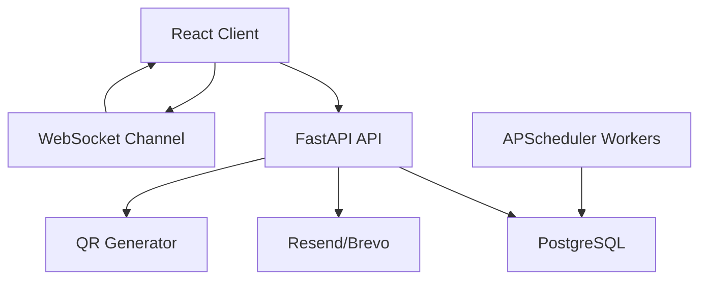

# Ticket Booking System

A full-stack ticket booking platform for movies and concerts with transactional seat holds, automatic hold expiry, FIFO waitlist offers, QR ticket generation, and real-time seat-map updates.

Payment processing is mocked for demonstration purposes.

## Features

- JWT authentication with `CUSTOMER`, `ORGANISER`, and `ADMIN` roles
- Venue creation and seat-layout management
- Event creation with per-event seat state
- Real-time seat map updates over WebSockets
- Transactional seat holds with configurable TTL
- Booking confirmation with QR ticket generation
- Booking cancellation with waitlist auto-assignment
- FIFO waitlist offers with configurable TTL
- Optional email delivery through Resend or Brevo
- Alembic migration for full PostgreSQL schema

## Architecture



- Frontend: React + Vite + React Router + Axios
- Backend: FastAPI + SQLAlchemy 2.x + PostgreSQL + Alembic
- Background jobs: APScheduler
- Realtime: FastAPI WebSockets
- Utilities: `qrcode`, `httpx`, `passlib`, `python-jose`

## Tech Stack

- React
- Vite
- JavaScript
- FastAPI
- SQLAlchemy 2.x
- PostgreSQL
- Alembic
- Pydantic
- JWT
- APScheduler

## Project Structure

```text
backend/
frontend/
README.md
SYSTEM_DESIGN.md
docker-compose.yml
```

The backend and frontend follow the required monorepo layout from the project brief.

## Prerequisites

- Python 3.11+
- Node.js 20+
- PostgreSQL 15+ or Docker

## Installation

### 1. Clone and configure environment files

```bash
cp backend/.env.example backend/.env
cp frontend/.env.example frontend/.env
```

### 2. Backend dependencies

```bash
cd backend
python3 -m venv .venv
source .venv/bin/activate
pip install -r requirements.txt
```

### 3. Frontend dependencies

```bash
cd frontend
npm install
```

## Environment Variables

### Backend

```env
DATABASE_URL=
JWT_SECRET=
JWT_EXPIRE_MINUTES=60

HOLD_TTL_MINUTES=10
WAITLIST_OFFER_TTL_MINUTES=10

FRONTEND_URL=

EMAIL_PROVIDER=
EMAIL_API_KEY=
EMAIL_FROM=
```

### Frontend

```env
VITE_API_URL=
VITE_WS_URL=
```

## Database Setup

Start PostgreSQL locally or with Docker, then run:

```bash
cd backend
alembic upgrade head
```

## Running Backend

```bash
cd backend
source .venv/bin/activate
uvicorn app.main:app --reload
```

Backend endpoints:

- API base: `http://localhost:8000/api`
- Swagger: `http://localhost:8000/docs`
- ReDoc: `http://localhost:8000/redoc`
- WebSocket: `ws://localhost:8000/ws/events/{event_id}`

## Running Frontend

```bash
cd frontend
npm run dev
```

Default frontend URL: `http://localhost:5173`

## API Documentation

FastAPI automatically exposes interactive docs at `/docs` and `/redoc`. Request and response schemas are modeled with Pydantic so the generated docs stay readable.

## Seat Hold Logic

Seat holds are persisted in PostgreSQL and linked to `event_seats` through `seat_holds`.

Core pattern:

```text
SELECT ... FOR UPDATE
+ sort seat ids before locking
+ verify event ownership and status
+ release only expired holds
+ set status=HELD and hold_expires_at
```

The database timestamp is the source of truth. APScheduler periodically releases expired holds, and the seat-map endpoint also performs an expiry sweep so stale holds are not shown longer than necessary.

## Concurrency Protection

Simultaneous hold requests cannot both succeed because:

- requested seat ids are sorted before locking to reduce deadlock risk
- seat rows are locked with `SELECT FOR UPDATE`
- availability is checked while the lock is held
- the entire hold or booking operation happens in one transaction

This prevents the classic race where two users both read `AVAILABLE` before either write commits.

## Waitlist Logic

The waitlist is FIFO per `event + category`.

Flow:

```text
WAITING
  -> OFFERED
  -> ACCEPTED and BOOKED
```

If an offer expires, the current implementation removes that entry instead of re-queuing it at the same position, then immediately offers the seat to the next waiting customer. This avoids repeatedly re-offering the same seat to the same expired entry.

## Real-Time Updates

Clients subscribe to `/ws/events/{event_id}`.

Broadcasts are emitted when:

- seats are held
- expired holds are released
- bookings are confirmed
- bookings are cancelled
- waitlist offers reserve or reassign seats

The frontend updates seat state without a full page refresh.

## QR Tickets

Confirmed bookings generate a PNG QR code containing only the booking reference, for example `TKT-8F29A1`.

No personal information, JWTs, or payment data are encoded in the QR payload.

## Email

Email delivery is handled by a shared service with provider-specific adapters for:

- Resend
- Brevo

Email failures are logged but do not roll back confirmed bookings or accepted waitlist offers.

## Testing

Backend tests live in `backend/tests`.

Run:

```bash
PYTHONPATH=backend python -m pytest backend/tests
```

Notes:

- service-level tests cover authentication, holds, TTL expiry, booking, cancellation, and waitlist flows
- PostgreSQL-only concurrency tests require `TEST_DATABASE_URL`
- in this workspace, the test run could not be executed end-to-end because `pytest` is not installed in the system Python environment yet

## Deployment

### Backend (Railway)

1. **Create Railway Account**: Sign up at [railway.app](https://railway.app)
2. **Connect GitHub**: Authorize Railway to access your repository
3. **Create New Project**:
   - Click "New Project"
   - Choose "Deploy from GitHub repo"
   - Select your `Tickbooking` repository
   - Railway will detect the `railway.json` configuration
   - Deploy

4. **Add PostgreSQL Database**:
   - In Railway project, click "New Service"
   - Select "PostgreSQL"
   - Railway will auto-configure the database connection

5. **Environment Variables** (Railway will auto-configure most):
   - `DATABASE_URL`: Auto-connected to Railway PostgreSQL
   - `JWT_SECRET`: Generate secure random string
   - `FRONTEND_URL`: Your Vercel frontend URL
   - `EMAIL_PROVIDER`: `resend` or `brevo` (optional)
   - `EMAIL_API_KEY`: Your email service API key (optional)
   - `EMAIL_FROM`: Sender email address (optional)

### Backend (Render - Alternative)

1. **Create Render Account**: Sign up at [render.com](https://render.com)
2. **Connect GitHub**: Authorize Render to access your repository
3. **Create Web Service**:
   - Select "New +"
   - Choose "Web Service"
   - Connect your `Tickbooking` repository
   - Use the provided `render.yaml` configuration
   - Deploy

4. **Environment Variables** (Render will auto-configure most):
   - `DATABASE_URL`: Auto-connected to Render PostgreSQL
   - `JWT_SECRET`: Auto-generated by Render
   - `FRONTEND_URL`: Your Vercel frontend URL
   - `EMAIL_PROVIDER`: `resend` or `brevo` (optional)
   - `EMAIL_API_KEY`: Your email service API key (optional)
   - `EMAIL_FROM`: Sender email address (optional)

### Frontend (Vercel)

1. **Create Vercel Account**: Sign up at [vercel.com](https://vercel.com)
2. **Install Vercel CLI** (optional):
   ```bash
   npm install -g vercel
   ```
3. **Deploy**:
   ```bash
   cd frontend
   vercel
   ```
   Or connect your GitHub repository in Vercel dashboard

4. **Environment Variables**:
   - `VITE_API_URL`: Your Railway/Render backend URL + `/api`
   - `VITE_WS_URL`: Your Railway/Render backend URL + `/ws`

### Quick Deployment Commands

```bash
# Deploy frontend to Vercel
cd frontend
vercel --prod

# Backend will be deployed automatically via railway.json
# Just push your changes to GitHub
git add .
git commit -m "Deployment updates"
git push origin main
```

### Post-Deployment Steps

1. **Update URLs**: After deployment, update environment variables:
   - Set `FRONTEND_URL` in Railway/Render to your Vercel URL
   - Set `VITE_API_URL` and `VITE_WS_URL` in Vercel to your Railway/Render URL

2. **Test Connections**:
   - Check backend health: `https://your-backend.railway.app/health`
   - Check frontend: `https://your-frontend.vercel.app`
   - Test WebSocket connection

3. **Database Migrations**: Railway runs migrations automatically via start.sh script

## Design Decisions

- `event_seats` stores state per event so venue layout remains reusable and booking state never leaks across events
- an extra `seat_holds` table is used because the booking flow requires a durable `hold_id` and hold ownership verification
- waitlist offers reserve seats by keeping the `event_seat` in `HELD` state while the offer is pending
- email and QR generation run after transactional state changes so delivery errors cannot corrupt seat ownership

