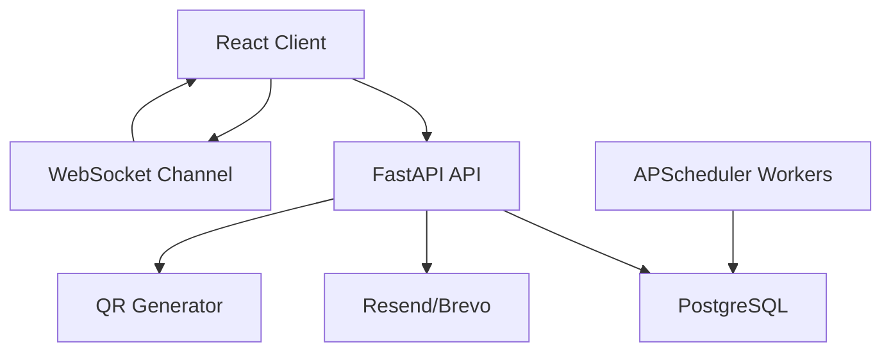

# System Design

This system uses React for the client and FastAPI with PostgreSQL for the backend. PostgreSQL is the source of truth for all seat ownership, hold expiry, bookings, and waitlist state.

## 1. Seat Hold and TTL Mechanism

Each event gets its own `event_seats` rows when the organiser creates it. Customer holds are tracked with a durable `seat_holds` table and linked back to `event_seats.hold_id`. When a hold succeeds, seats move to `HELD` and `hold_expires_at` is written to PostgreSQL using the configured `HOLD_TTL_MINUTES`.

Expired holds are released by APScheduler workers and also cleaned up during seat-map reads so the UI does not drift behind the database.

## 2. Concurrency Prevention

Seat holds and bookings lock rows with `SELECT ... FOR UPDATE`. Requested seat ids are sorted before locking to reduce deadlock risk. While the transaction is open, the backend verifies:

- the seat belongs to the requested event
- the seat is not booked
- any prior hold is truly expired

Only then does it update the status. This prevents two simultaneous requests from successfully holding the same seat.

## 3. Waitlist Auto-Assignment

The waitlist is FIFO per `event_id + category`. When a booking is cancelled, the released seat is still locked in the same transaction. The service checks the earliest `WAITING` entry in that category and creates a `waitlist_offer`. If a matching customer exists, the seat is immediately reserved for that offer instead of becoming publicly available.

## 4. Time-Limited Offer Handling

Offers carry `expires_at` from `WAITLIST_OFFER_TTL_MINUTES`. While an offer is pending, the seat remains `HELD`. If the offer is accepted in time, the system creates a booking and marks the offer `ACCEPTED`. If it expires, the worker marks the entry `REMOVED` and offers the seat to the next waiting customer. This chosen policy avoids repeatedly re-offering the same expired entry.

## 5. Seat Map Data Model

The physical venue layout lives in `venue_seats`. Availability never lives there. `event_seats` copies the venue layout for every event and stores:

- category
- price
- status
- hold expiration

That keeps seat state correct per event and allows the same venue to host many independent shows.

## 6. Real-Time Updates

Clients subscribe to `/ws/events/{event_id}`. The backend broadcasts seat changes after holds, expiry, booking, cancellation, and waitlist reservation. The frontend updates the local seat map directly from these messages rather than polling the entire event constantly.

## 7. QR and Email Flow

After a booking commits, the backend generates a QR code containing only the booking reference. Booking confirmations and waitlist offers are sent through the shared email service. Email runs after the database transaction, so delivery failures are logged without rolling back confirmed bookings.

